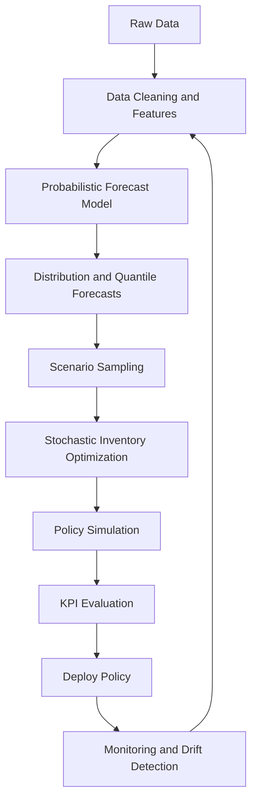

# Blog Writing Guide
## Probabilistic Demand Forecasting + Stochastic Optimization for Inventory Control

Date: 2026-03-21

## 1. Goal of This Blog
Write a research-backed technical post that shows how to:
- Forecast demand as a probability distribution (not a single point).
- Convert forecast uncertainty into inventory decisions.
- Evaluate methods using business KPIs (cost, service level, stockouts), not only forecast error.

---

## 2. Suggested Blog Title Options
1. From Probabilistic Forecasts to Inventory Decisions: A Stochastic Optimization Route
2. Beyond RMSE: Decision-Centric Demand Forecasting for Inventory Control
3. Probabilistic Demand Forecasting Meets Stochastic Inventory Optimization

---

## 3. Storyline (High-Level)
1. Forecasting alone is not enough.
2. Uncertainty-aware forecasting provides full demand distributions.
3. Inventory decisions should be optimized over that uncertainty.
4. End-to-end evaluation should use operational metrics.

---

## 4. Core Literature Map (Research Directions)

### A) Probabilistic Forecasting Foundations
- DeepAR (probabilistic autoregressive forecasting)
- Temporal Fusion Transformer (interpretable multi-horizon forecasting)
- N-BEATS (strong baseline; primarily point forecasting but useful benchmark)
- Deep Renewal Processes (intermittent demand)
- Probabilistic hierarchical and count-based deep models

### B) Inventory Optimization Under Uncertainty
- Newsvendor model (single-period)
- Multi-period stochastic inventory control
- Service-level constrained optimization
- Scenario-based stochastic programming

### C) Robust and Distributionally Robust Decision Models
- Distributionally robust newsvendor with ambiguity sets
- Moment-based or metric-based robust formulations

### D) Forecast-to-Decision Bridge
- Business metric-aware forecasting for inventory management
- Recent work on evaluating forecasting via inventory cost and service KPIs

### E) Journal Targets for Credible References
- International Journal of Forecasting
- Journal of Forecasting
- Management Science
- Operations Research
- Manufacturing and Service Operations Management
- European Journal of Operational Research
- Production and Operations Management

Note: Some 2024-2026 items are preprints. Label them explicitly as preprint evidence in the post.

---

## 5. Mathematical Backbone (Ready to Paste)

### 5.1 Probabilistic Forecasting Objective
Let demand at horizon h be:

$$
D_{t+h} \sim \hat{F}_{t+h}(\cdot \mid \mathcal{X}_t)
$$

where $\mathcal{X}_t$ is all information available at time t.

### 5.2 Quantile (Pinball) Loss

$$
L_\tau(y, \hat{q}_\tau) = (\tau - \mathbf{1}\{y < \hat{q}_\tau\})(y - \hat{q}_\tau)
$$

### 5.3 Newsvendor Cost Minimization

$$
\min_q \; \mathbb{E}\left[c_o(q-D)^+ + c_u(D-q)^+\right]
$$

with overage cost $c_o$ and underage cost $c_u$.

### 5.4 Critical Fractile Policy

$$
q^* = F_D^{-1}\left(\frac{c_u}{c_u + c_o}\right)
$$

### 5.5 Multi-Period Inventory Dynamics

$$
I_{t+1} = I_t + Q_t - D_t
$$

### 5.6 Typical Stochastic Program

$$
\min_{\{Q_t\}} \; \mathbb{E}\left[\sum_{t=1}^{T} h(I_t)^+ + b(-I_t)^+ + cQ_t\right]
$$

subject to operational constraints (capacity, MOQ, lead time, service level).

---

## 6. Blog Structure (Section by Section)

### Section 1: Why Accuracy Alone Fails
- Show a case where a lower RMSE model gives worse inventory outcomes.
- Introduce decision-aware evaluation.

### Section 2: Problem Setup and Notation
- Define demand, lead time, costs, service-level constraints.
- Present equations in Section 5.

### Section 3: Probabilistic Forecasting Layer
- Explain predictive distributions, quantiles, calibration.
- Compare methods (classical + deep models).

### Section 4: Stochastic Optimization Layer
- Start with newsvendor intuition.
- Extend to multi-period decision-making under scenarios.

### Section 5: Experiment Design
- Rolling-origin backtesting.
- Scenario generation from predictive distribution.
- Replenishment simulation with fixed policy assumptions.

### Section 6: KPI-Driven Comparison
- Forecast metrics: CRPS, pinball loss, coverage.
- Inventory metrics: total cost, fill rate, stockout frequency, holding cost.

### Section 7: Practical Deployment
- Retraining cadence
- Drift and recalibration checks
- Guardrails for safety stock and exception handling

### Section 8: Conclusion
- Best model is the one that minimizes expected operational loss, not only forecast error.

---

## 7. Visual and Infographic Plan

### Visual 1: Pipeline Infographic
Data -> Feature Engineering -> Probabilistic Forecast -> Scenario Generator -> Stochastic Optimizer -> Replenishment Policy -> KPI Dashboard

### Visual 2: Forecast Fan Chart
- Plot P10, P50, P90 against actual demand.
- Show uncertainty widening with horizon.

### Visual 3: Calibration Plot
- Predicted quantile coverage vs empirical coverage.
- Ideal line: diagonal.

### Visual 4: Cost-Service Frontier
- x-axis: service level
- y-axis: total expected inventory cost
- one curve per forecasting + optimization combo

### Visual 5: KPI Boxplots from Simulation
- Stockout rate
- Holding cost
- Total cost

### Visual 6: Decision Flowchart
Use Mermaid block below.

---

## 8. Suggested Figure Captions
1. End-to-end route from uncertain demand prediction to inventory action.
2. Quantile forecast fan showing calibrated uncertainty around demand trajectory.
3. Calibration diagnostics showing alignment between nominal and empirical coverage.
4. Trade-off frontier between service level and total inventory cost.
5. Monte Carlo simulation comparison of policy risk and cost outcomes.

---

## 9. Step-by-Step Writing Checklist
1. Pick one business use case (retail, spare parts, grocery, pharma).
2. Define demand characteristics (smooth, seasonal, intermittent, lumpy).
3. Write Section 1 and 2 first (motivation + math setup).
4. Add one forecasting family deeply before expanding.
5. Add one optimization formulation deeply (newsvendor, then multi-period).
6. Build simulation and KPI tables.
7. Add visuals and captions.
8. Final pass: assumptions, limitations, and preprint labeling.

---

## 10. Optional Extensions (Advanced)
- Distributionally robust optimization (Wasserstein or moment constraints)
- Conformal prediction for calibrated quantiles under shift
- Joint learning of forecasting and decision objective (decision-focused learning)
- Multi-echelon inventory and lead-time uncertainty

---

## 11. What to Prepare Next
To write the first publishable draft quickly, define:
1. Industry context
2. Decision cadence (daily/weekly)
3. Cost structure (stockout penalty vs holding cost)
4. Lead-time assumptions
5. Target audience (research, industry, mixed)

Once these are fixed, draft Section 1-2 and generate the first chart set.
